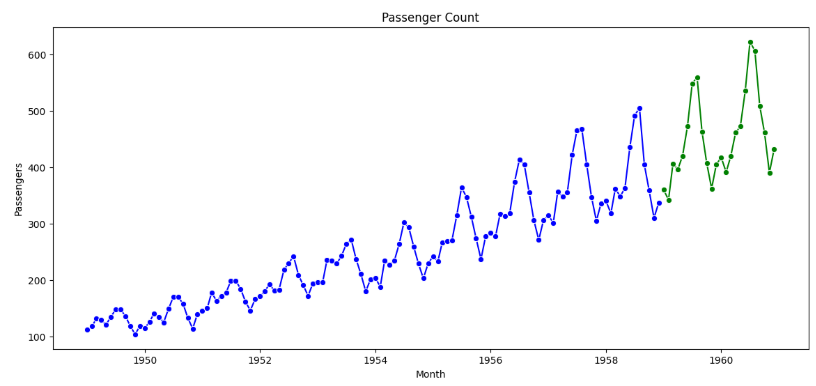
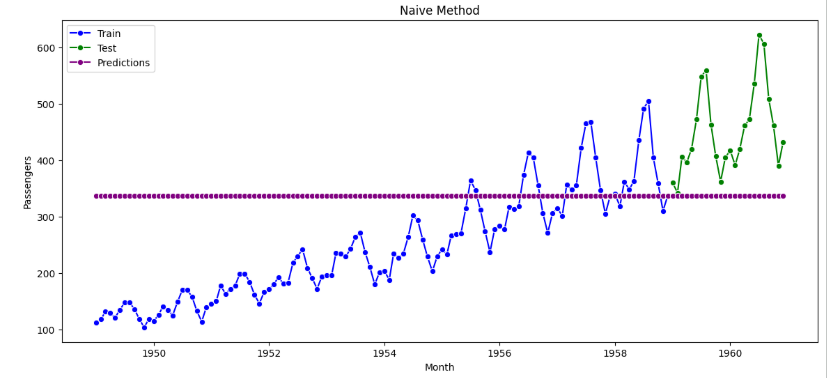
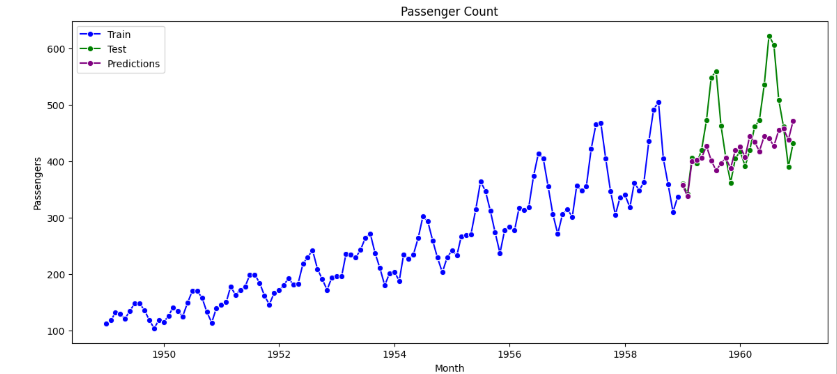
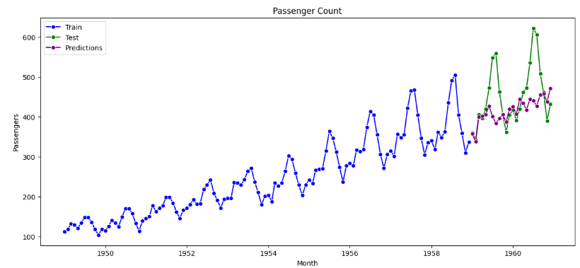

# Airline Passenger Demand Forecasting — Time Series Analysis

Applied and compared 13 classical time series forecasting techniques to predict monthly airline passenger volume, from simple baselines to seasonal ARIMA models. The goal was to identify which approach best captures the strong trend and seasonality in the data.

**Tools used:** pandas, numpy, matplotlib, seaborn, statsmodels

## Key Insights

**The data shows a clear upward trend with strong yearly seasonality** — passenger counts rise every year with a repeating seasonal pattern, which rules out simple trend-only models from the start.

**Simple models that ignore seasonality underperform badly.** The Naive method, which just carries the last training value forward as a flat line, posted an RMSE of 137.33 — it cannot capture the seasonal swings or the upward trend at all.

**Holt-Winters' Multiplicative Method was the clear winner**, achieving an RMSE of 32.49 and MAPE of 6.39% — less than half the error of the next-best model. Because it models seasonality as multiplying the trend (rather than adding to it), it captured the growing size of the seasonal swings as passenger volume increased over the years.

**Among the autoregressive family, SARIMA performed best** (RMSE 77.65), since it's the only one of the group that explicitly models seasonality — but it still trailed Holt-Winters Multiplicative by a wide margin, showing that not every "more advanced" model wins on every dataset.

**Across all 13 models tested, the full comparison makes the gap clear:**

| Model | RMSE | MAPE (%) |
|---|---|---|
| Holt-Winter's Multiplicative | **32.49** | **6.39** |
| Holt-Winter's Additive | 35.76 | 6.64 |
| Linear Regression | 74.79 | 11.22 |
| MA | 76.28 | 15.33 |
| SARIMA | 77.65 | 10.00 |
| ARIMA | 79.35 | 13.84 |
| ARMA | 83.40 | 17.21 |
| Holt's | 115.70 | 18.41 |
| AR | 132.17 | 21.66 |
| Simple Exponential Smoothing | 137.33 | 23.58 |
| Naive | 137.33 | 23.58 |
| Simple Moving Average | 138.73 | 23.96 |
| Simple Average | 219.44 | 44.23 |

## What's Covered

1. Data preparation and train-test split
2. Baseline models — Linear Regression, Naive, Simple Average, Simple Moving Average
3. Exponential smoothing models — SES, Holt's, Holt-Winters Additive and Multiplicative
4. Stationarity testing, Box-Cox transformation, and differencing
5. Autoregressive models — AR, MA, ARMA, ARIMA, SARIMA (with ACF/PACF-guided order selection)
6. Model evaluation and comparison using RMSE and MAPE

## Data Source

The classic Airline Passengers dataset — monthly totals of international airline passengers from 1949 to 1960.

## Notebook

See [`TSA_Airline_Forecasting_Project.ipynb`](TSA_Airline_Forecasting_Project.ipynb) for the full analysis.
